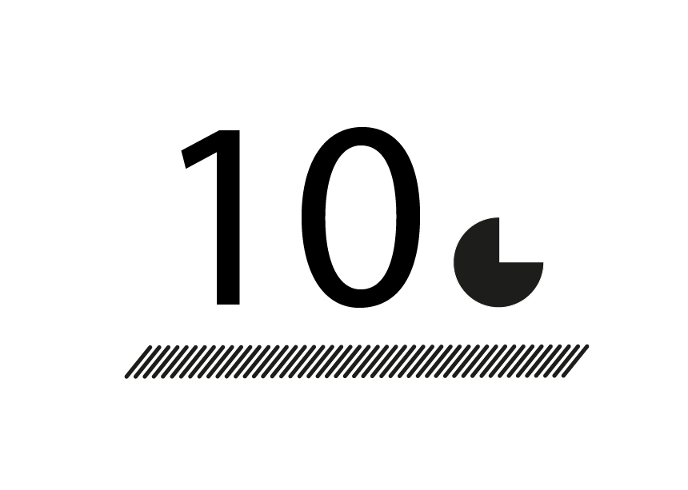

# Projet: JS Clocks (GR461)

Un projet de design web dont l'objectif est de concevoir une interface permettant de visualiser l'écoulement du temps.

Détail du brief: https://3.basecamp.com/3165988/buckets/4702925/vaults/650815541

## Fonctionnement

Les secondes sont représentées par un graphique qui se remplit pendant 1 seconde.  
La minute quand à elle est représentée par des barres penchées et à distance égale.  
L'heure est simplement affichée en désignant son nombre.

Automne 2017  
Eracom, Lausanne
